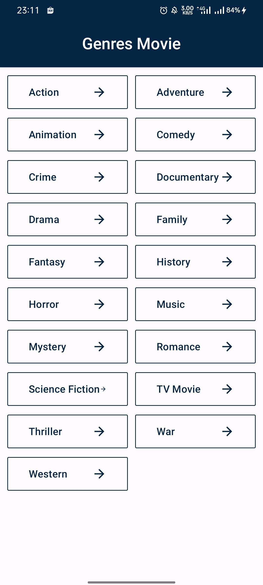
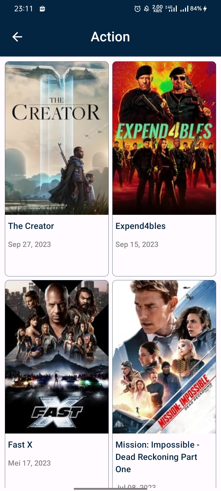
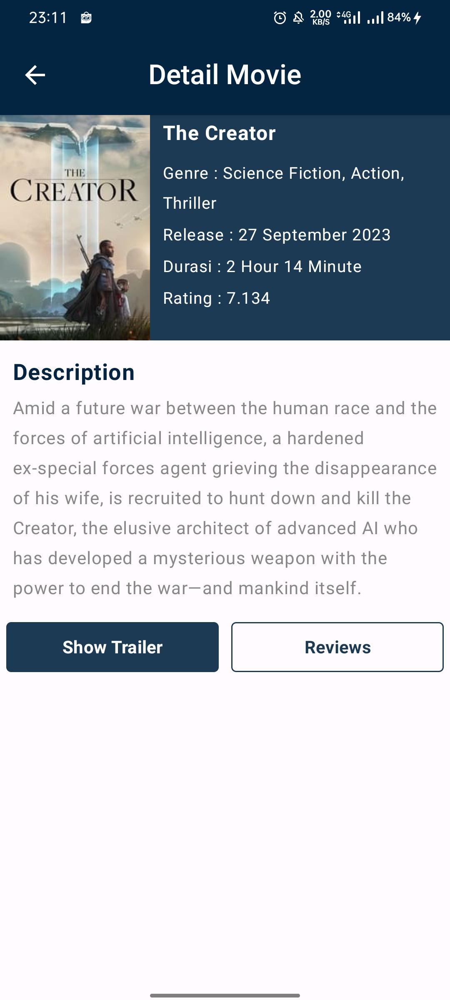
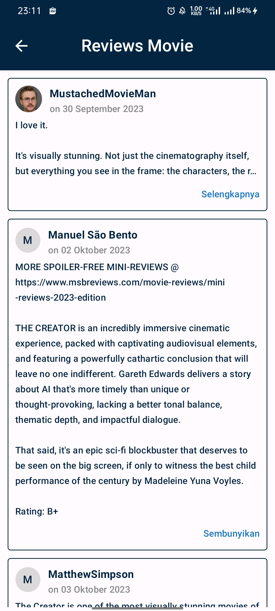
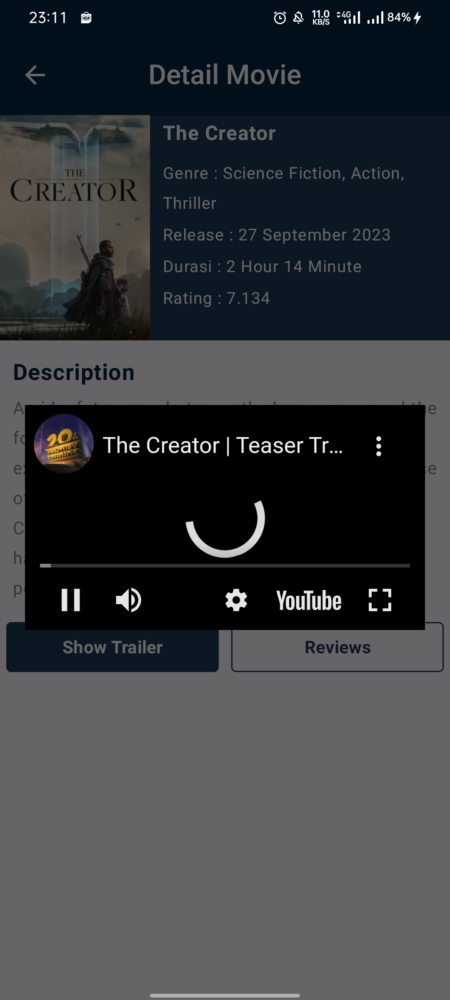
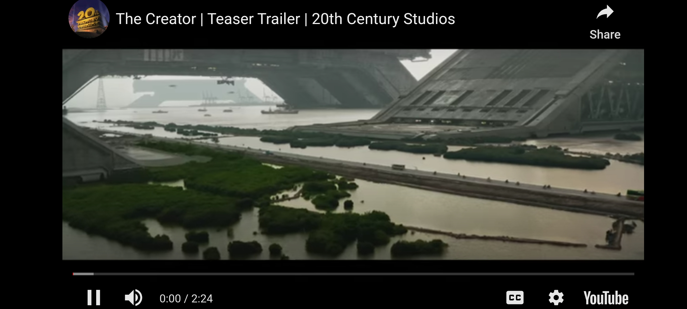

## Tentang Aplikasi

My Movies adalah aplikasi android untuk lihat daftar film yang telah ditonton. Sumber data aplikasi ini menggunakan public api source dari <a href = "https://www.themoviedb.org/">The Movie DB</a>
Aplikasi ini di bangun menggunakan :  
- [x] Kotlin sebagai bahasa Pemrogaman Utama</a>
- [x] Jetpack Compose sebagai UI Layout</a>
- [x] Clean Architecture & MVVM</a>
- [x] Hilt untuk Dependency Injection </a>
- [x] Retrofit2 untuk networking dan konsumsi REST API</a>
- [x] Coil untuk ImageLoader</a>
- [x] Android Youtube Player untuk Play Video dari Youtube</a>

Aplikasi ini memiliki beberapa fitur :
- [x] Halaman Splash
- [x] Halaman Daftar Genre
- [x] Halaman Daftar Film Berdasar Genre
- [x] Halaman Detail Film 
- [x] Halaman Daftar Review dari Film
- [x] Halaman Fullscreen Video Trailer Film

## Preview Aplikasi

